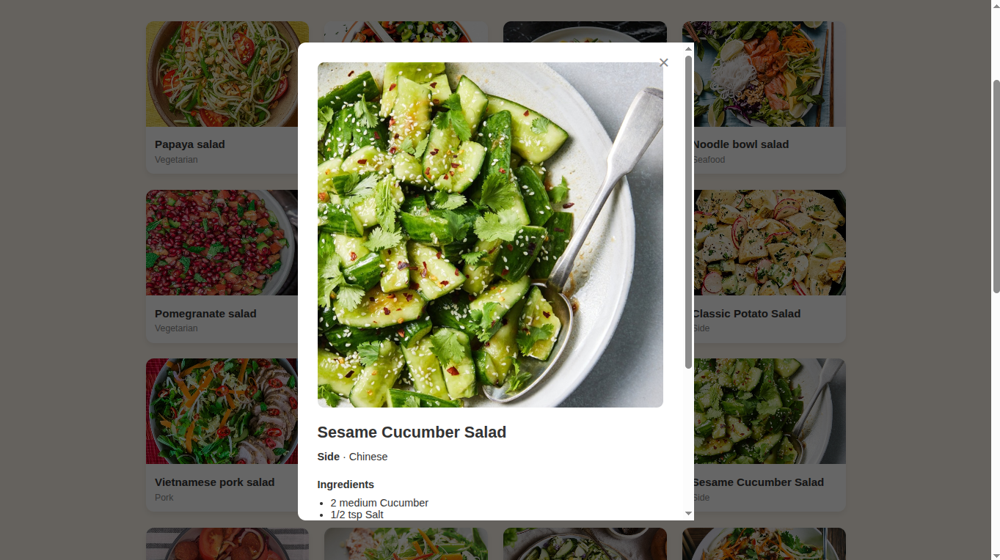

# Recipe Finder

A recipe search app built with Flask, HTML/CSS/JS, and the TheMealDB API. Used to practice Git, Docker, and GitHub Actions (CI/CD).

## Screenshot

## What the app does
- Search recipes by name or ingredient
- View recipe details including ingredients and cooking instructions
- Clean, responsive UI

## Run locally

    python3 -m venv venv
    source venv/bin/activate
    pip install -r requirements.txt
    python app/main.py

Then open http://localhost:5000 in your browser.

## Run tests

    pytest

## Run with Docker

    docker build -t recipe-finder .
    docker run -p 5000:5000 recipe-finder

## Docker Hub
Pre-built image available at: https://hub.docker.com/r/codersadia/recipe-finder

    docker pull codersadia/recipe-finder
    docker run -p 5000:5000 codersadia/recipe-finder

## CI/CD
Pushing to GitHub triggers `.github/workflows/ci.yml`, which automatically runs tests and builds the Docker image (visible under the Actions tab).

## Tech stack
- Backend: Flask (Python)
- Frontend: HTML, CSS, JavaScript
- API: TheMealDB (free, no API key required)
- DevOps: Git, Docker, GitHub Actions
